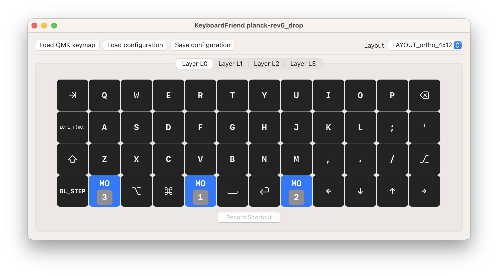

  

This is a simple little application for macOS that can show you an overlay of a layer on your keyboard.
Availible on Github, [KeyboardFriend](https://github.com/fredlb/KeyboardFriend)

You give it your [QMK json layout](https://config.qmk.fm/#/planck/rev6_drop/LAYOUT_ortho_4x12), and it allows you to set a hotkey for a layer. Tapping down that hotkey will display an overlay (that does not steal focus) of the current layer. Tap it again to hide!

  

  

