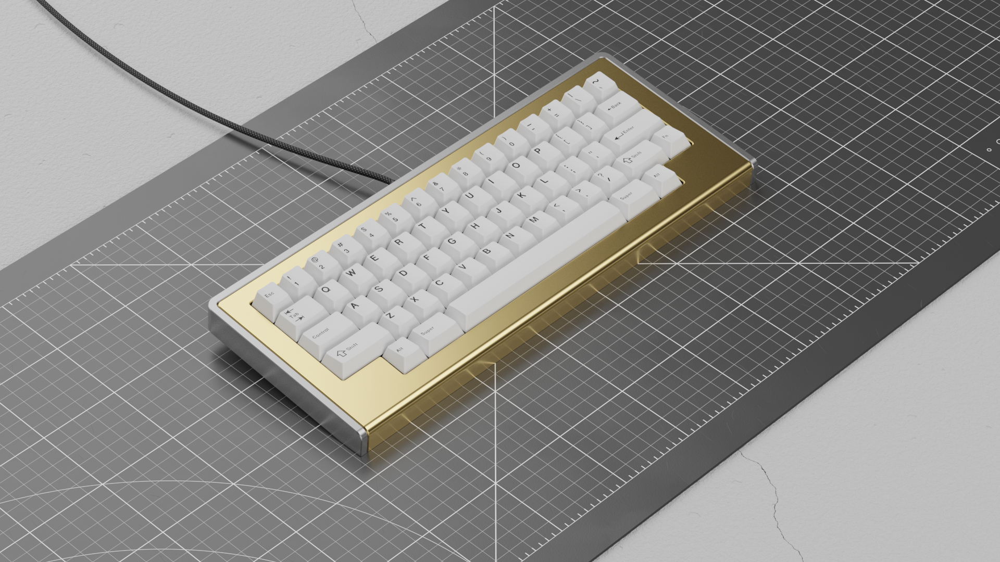
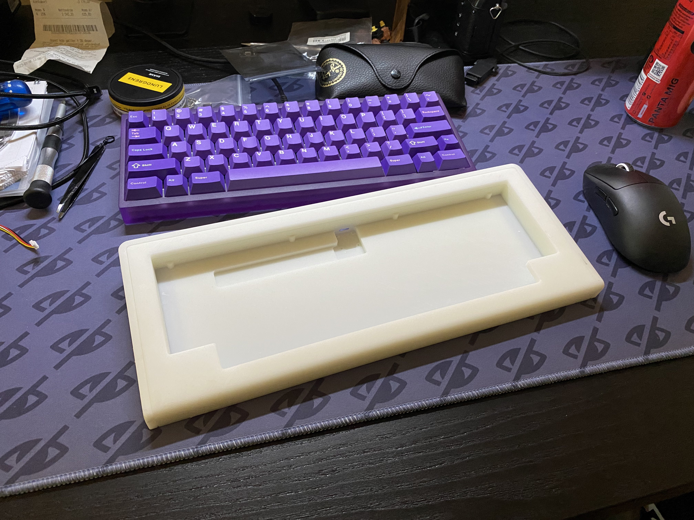
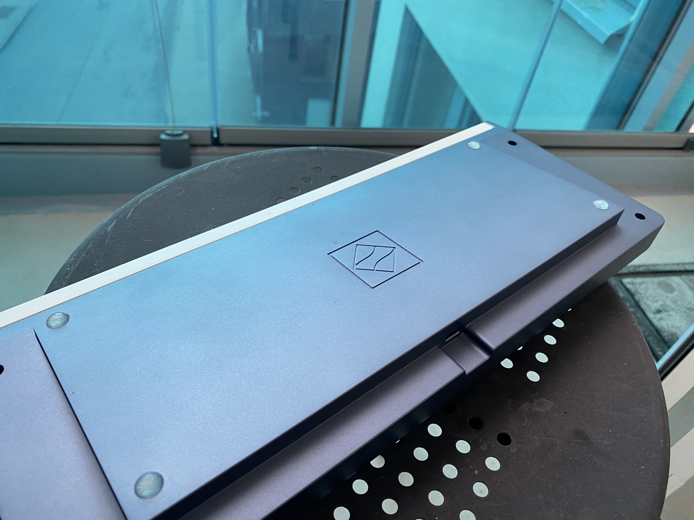
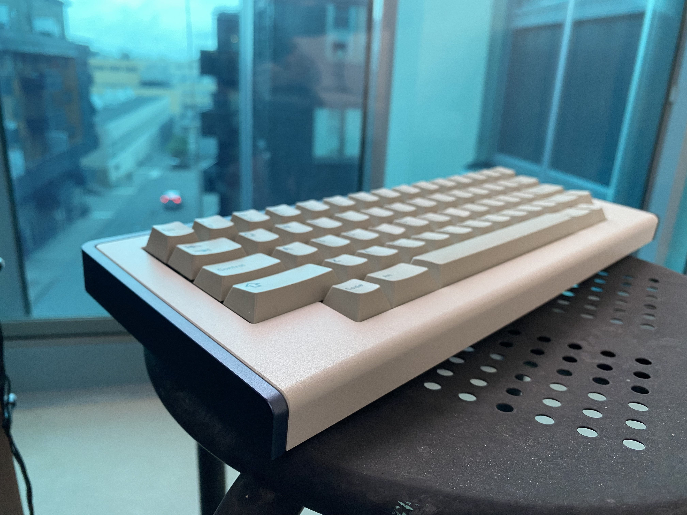

I have an unhealthy obsession with keyboards. For years I've collected different kinds of keyboards, and it has been fun.

But there is something that I don't like about mindlessly consuming luxury grade computer peripherals (with no real benefits over any regular keyboards). I guess I just like looking at them and using them, much like someone who collected watches would do.

So, to sort of get to "the end" with this obsession, or potentially dig the hole even further, I set out to design and have my own design manufactured. Just to make something slightly more interesting than clicking "buy now" on another +$300 keyboard.

## tl;dr
Here is my "final" prototype, manufactured in aluminum. It's essentially a fork of the popular open source design [bakeneko60](https://github.com/kkatano/bakeneko-60), but supports other physical layouts such as the one here in HHKB-style.

## Design/CAD
I started out my design by simply modifying the design from bakeneko-60, since it's a design that has gone through several improvements and is compatible with several open source PCBs, such as the [waffling60](https://github.com/4pplet/waffling60).
The biggest difference from the bakeneko60 is the support of other physical layouts, such as HHKB or WKL (winkey-less). To make this happen in the easiest way without having to make a custom PCB and plate, I opted to go for a 2-part design.

## Resin-printed prototype
To get something physical in my hands without spending too much money upfront I ordered a resin printed prototype. I did some slight adjustments to this design before sending it to the manufacture, such as designing around threaded inserts instead of threads in the plastic since that wears out quickly. Given the somewhat large footprint of the design (~335mm on the largest axis), I had this done by Elecrow.

I was surprised about the really good quality I managed to get on the first try with this. The resin prototype exhibits very little "bowing/bending" and works great.
The biggest problem I had with this prototype was the fact that I didn't account for enough shrinkage that inherently happens with 3d-printing, especially around through-holes and the holes for the threaded inserts. This was easily solved by just expanding the holes slightly with a Dremel.
I used heat-set threaded inserts, but just attached them with CA glue since resin doesn't melt with heat, it just crumbles.

I used it for a few weeks while still tweaking the final design for the aluminum prototype I ultimately wanted to have manufactured.

## Final prototype in aluminum
Ironically enough, this part was the easiest. I got in contact with Alva at [Gaojie](https://www.gj-prototype.com/), which quickly got back with a very good quote for a one-off prototype, including anodization and electro-coating of the parts. They were even kind enough to include compatible screws!

Originally I had the intention of doing the top piece in brass, but that was quite expensive and in no way would add anything but weight, so I opted for an electro-coating in beige. The bottom is a blue-grey anodization.

## The end
I started this design on March 23rd, and the final prototype was in my hands on May 16th. I really enjoyed all parts of doing this, and I'm very happy I took it all the way and didn't just stop after the design phase. It's somewhat surreal after all these years in the hobby to type this on my own keyboard :)

### Thanks and shout-out
kkatano for designing the bakeneko60

[4pplet](https://4pplet.com/) for designing the waffling60 and help along the way

All the members on the [Swedish keyboard community](https://mekaniskatangentbord.se) that helped out, came with advice and opinions and pushed me to get this done. 

Alva at [Gaojie](https://www.gj-prototype.com/) for all the help in manufacturing the final prototype.

## Additional photos and details of the finished prototype

