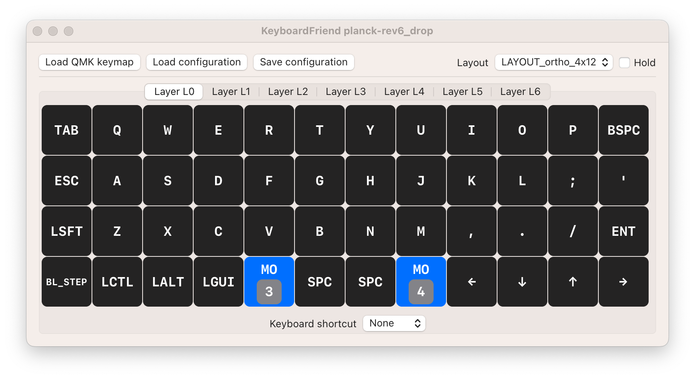
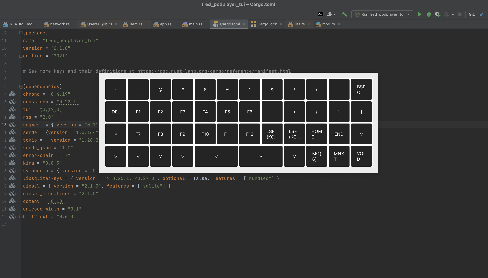

  

This is a simple little application for macOS that can show you an overlay of a layer on your keyboard.
Availible on Github, [KeyboardFriend](https://github.com/fredlb/KeyboardFriend)

You give it your [QMK json layout](https://config.qmk.fm/#/planck/rev6_drop/LAYOUT_ortho_4x12), and it allows you to set a hotkey (F16-F20) for a layer.
Holding down that hotkey will display an overlay, that does not steal focus, of the current layer.

  

  

