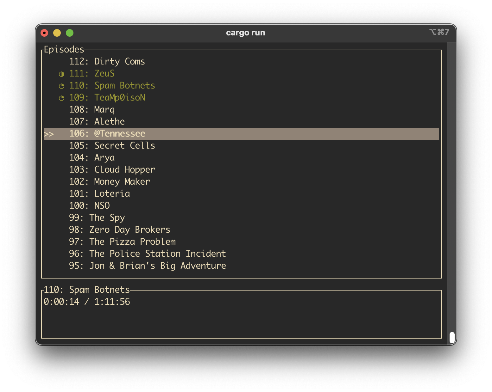

I made a simple podcast player that runs in the terminal. It is written in Rust and has a very small memory footprint (<4mb).

It's backed by a SQLite db to keep track of podcasts and their episodes including what has been played and the current progress.

It pulls information from the RSS feeds of the podcasts and stores the audio files on disk.

[Check it out on Github](https://github.com/fredlb/fred_podplayer_tui)

